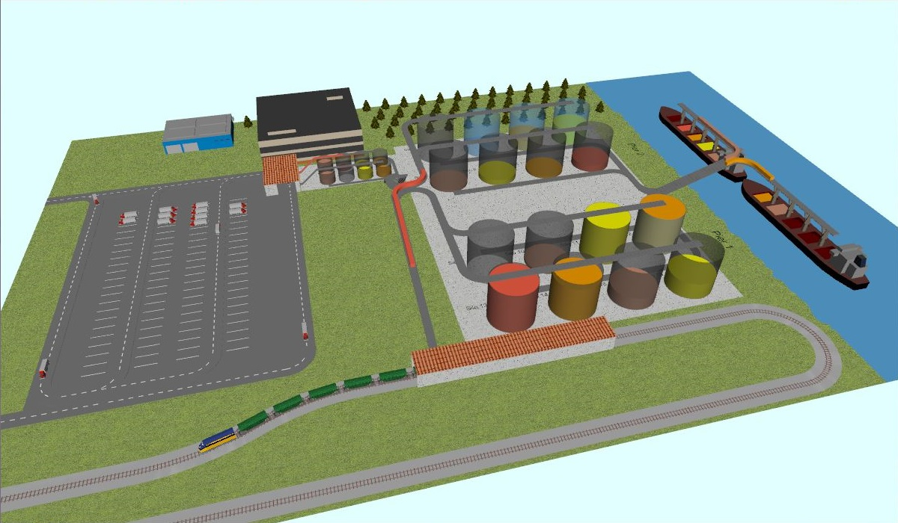

# AnyLogic Grain Terminal Demo

A hands-on introduction to **AnyLogic Learning Edition** through a real simulation model — a grain terminal that moves grain from trucks and trains, through silos, and onto ships.

This repo walks you through understanding, extending, and visualizing an AnyLogic discrete-event simulation. No prior simulation experience required.



## What's Inside

```
model/                  The AnyLogic model (.alp) and 3D assets
visualization/          A Three.js web app that visualizes the simulation
docs/
  01-primer.md          What AnyLogic is and why it matters
  02-understanding.md   Full walkthrough of the grain terminal model
  03-extending.md       Tutorial: adding truck appointment scheduling
  04-visualization.md   Building a Three.js visualization from a sim model
```

## Quick Start

### 1. Open the Model

1. Download [AnyLogic Learning Edition](https://www.anylogic.com/downloads/) (free)
2. Open `model/Grain Terminal1.alp`
3. Click **Run** to see the simulation in action

### 2. View the Visualization

Open `visualization/index.html` in any modern browser. No build step needed.

- Orbit with mouse drag, zoom with scroll
- Use the speed controls (1x/2x/5x/10x) to fast-forward
- Watch grain flow from trucks through silos to ships in real time

### 3. Read the Guides

Start with [01 - Primer](docs/01-primer.md) if you're new to AnyLogic, or jump to [03 - Extending the Model](docs/03-extending.md) if you want to get your hands dirty.

## The Model at a Glance

The grain terminal simulates three concurrent operations:

- **Trucks** arrive on a road, park, wait for an appointment slot, and unload grain into auto silos
- **Trains** arrive on a rail track and unload grain directly into main silos
- **Ships** dock at piers and load grain from main silos into their bilges

Key parameters: 16 main silos (5,000 tons each), 4 auto silo rows, 2 piers, 4 grain types, truck appointment scheduling with priority queuing.

## What You'll Learn

| Guide | You'll learn... |
|-------|----------------|
| [Primer](docs/01-primer.md) | What AnyLogic is, DES basics, Learning Edition capabilities |
| [Understanding](docs/02-understanding.md) | How to read a simulation model, identify flows, trace logic |
| [Extending](docs/03-extending.md) | How to add parameters, variables, functions, and modify queue logic in the `.alp` XML |
| [Visualization](docs/04-visualization.md) | How to translate simulation concepts into an interactive 3D web app |

## Requirements

- **AnyLogic Learning Edition 8.9+** (free download)
- A modern browser for the Three.js visualization (Chrome, Firefox, Safari, Edge)
- A text editor for XML editing (VS Code recommended)

## License

This demo is provided for educational purposes. The AnyLogic model is based on a sample from AnyLogic and extended with truck appointment scheduling logic. The Three.js visualization is original work.
