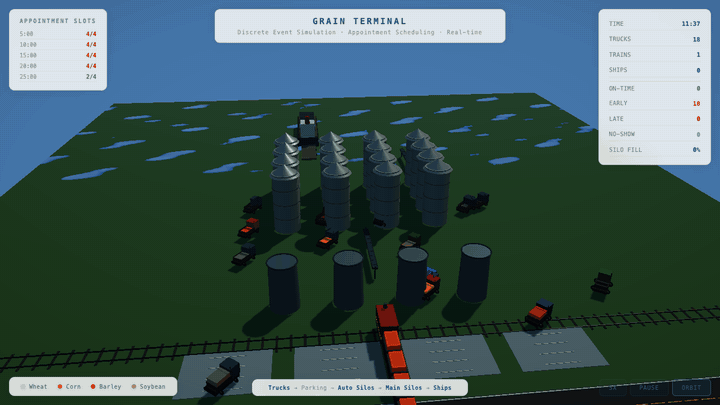

# Claude Meets AnyLogic

I gave Claude (via [Claude Code](https://docs.anthropic.com/en/docs/claude-code)) an AnyLogic simulation model and asked it to:

1. **Understand it** — explain every flow, agent, and parameter
2. **Extend it** — add truck appointment scheduling with priority queuing
3. **Visualize it** — build a real-time 3D web app from scratch

It did all three. This repo is the result.



## What Happened

I started with a grain terminal model from AnyLogic's example library — trucks, trains, and ships moving grain through silos. A 34,000-line XML file I hadn't touched.

**The conversation went like this:**

- "What is going on here?" — Claude read the `.alp` file, identified all agents, flowcharts, and functions, and explained the three concurrent flows (trucks → auto silos → main silos, trains → main silos, ships ← main silos)
- "Let's extend it with truck appointment scheduling" — Claude added 4 new parameters, 5 tracking variables, 4 per-truck state fields, 2 new functions, and modified the queue priority logic — all by editing the XML directly
- "Build a Three.js app that makes the process easy to grasp" — Claude wrote a self-contained visualization with animated entities, grain particle effects, dynamic silo fill levels, ship loading, appointment slot tracking, and a full HUD

No copy-paste from docs. No templates. Just Claude reading the model, reasoning about the domain, and writing code.

## Try It Yourself

### The Visualization

Open `visualization/index.html` in any browser. No install, no build step.

- Mouse drag to orbit, scroll to zoom
- Speed controls: 1x / 2x / 5x / 10x
- Watch trucks arrive, get appointments, unload grain through silos onto ships

### The AnyLogic Model

1. Download [AnyLogic Learning Edition](https://www.anylogic.com/downloads/) (free)
2. Open `model/Grain Terminal1.alp`
3. Hit Run

## What's Inside

```
model/                  The AnyLogic model + 3D assets
visualization/          Three.js web app (single HTML file)
docs/
  01-primer.md          AnyLogic & simulation basics
  02-understanding.md   Full model walkthrough
  03-extending.md       How the appointment system was added (step by step)
  04-visualization.md   How the Three.js app was built
```

## The Guides

These are written for anyone who wants to replicate this workflow — use Claude to understand, extend, and visualize simulation models.

| Guide | What's in it |
|-------|-------------|
| [Primer](docs/01-primer.md) | What AnyLogic is, discrete-event simulation basics, what Learning Edition gives you for free |
| [Understanding the Model](docs/02-understanding.md) | The three flows (trucks, trains, ships), all agent types, key parameters, the Scheduler, how `.alp` XML is structured |
| [Extending the Model](docs/03-extending.md) | Step-by-step: adding parameters, variables, functions, and queue logic to the `.alp` XML. The full truck appointment scheduling implementation |
| [Three.js Visualization](docs/04-visualization.md) | Mapping simulation concepts to 3D: entities as mesh groups, fluid flow as particles, fill levels as scaled geometry, state machines driving animation |

## The Model

A grain terminal with three concurrent operations:

- **Trucks** arrive every 30s, get assigned appointment slots, queue by priority (on-time > early > late), unload into auto silos. No-shows are ejected after 10 min.
- **Trains** deliver 1,000 tons directly into main silos, bypassing the auto silo buffer.
- **Ships** dock at 2 piers, load grain from the 16 main silos (5,000 tons each) into 5 bilges per ship.

4 grain types. Priority-based queuing. Appointment scheduling. All running concurrently.

## Why This Matters

AnyLogic models are powerful but opaque — thousands of lines of XML, Java logic scattered across agents, domain knowledge baked into parameter names. Claude can read all of it, reason about the domain, and produce working extensions and visualizations.

If you work with simulation models, this is a new workflow: **describe what you want in plain English and let Claude do the engineering**.

## Requirements

- A modern browser (for the visualization)
- [AnyLogic Learning Edition](https://www.anylogic.com/downloads/) 8.9+ (free, for the model)

## License

Educational use. The base model is from AnyLogic's example library. Extensions and visualization are original work produced with Claude.
